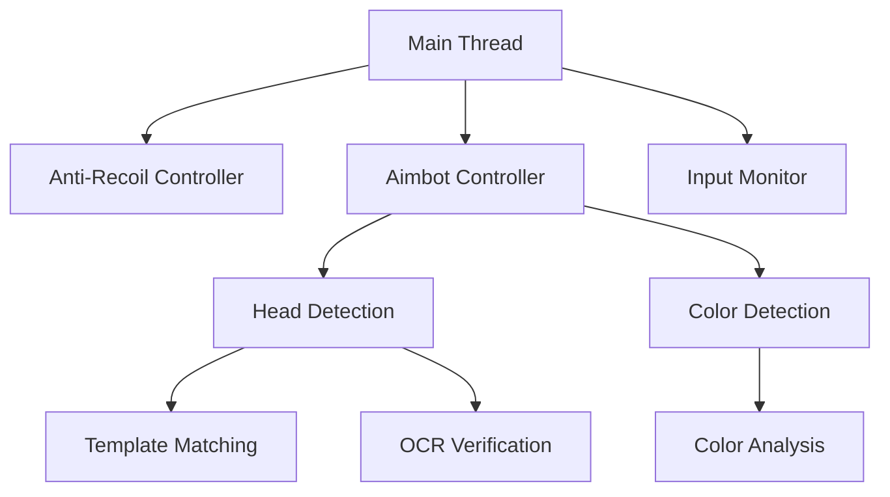

## Game Assistance Tool  
**Version: 1.1.0 Beta**  
*Created by AiTechnologyDev*  

  
[](https://github.com/AiTechnologyDev/game-assistance-tool)  
[](https://t.me/AiTechnologyDev)

Advanced game assistance tool featuring smart anti-recoil, color-based aimbot, and AI-enhanced head detection without modifying game files. Perfect for FPS games!

## Features 🚀
- **Smart Anti-Recoil System**  
  Automatically counters weapon recoil while preserving intentional mouse movements
- **Color-Based Aimbot**  
  Detects enemies by configurable color signatures with CPU optimization
- **AI Head Detection**  
  Uses template matching with OCR verification for precision aiming
- **Dynamic Performance Tuning**  
  Automatically reduces CPU load when not in combat
- **Hotkey Toggle System**  
  Enable/disable features instantly during gameplay
- **Cross-Platform Support**  
  Works with most popular FPS games

## Installation ⚙️
1. Install Python 3.8+
```bash
python --version
```
2. Install Tesseract OCR:
   - **Windows**: [Installation Guide](https://github.com/UB-Mannheim/tesseract/wiki)
   - **Linux**: `sudo apt install tesseract-ocr`
3. Install dependencies:
```bash
pip install -r requirements.txt
```

## Configuration 🛠️
Edit the top section of `assistant.py`:
```python
# ======================
# CONFIGURATION SETTINGS
# ======================
ANTI_RECOIL_TOGGLE_KEY = 'f1'      # Toggle anti-recoil
AIMBOT_TOGGLE_KEY = 'f2'           # Toggle color aimbot
HEAD_DETECTION_TOGGLE_KEY = 'f3'   # Toggle head detection
SHOOT_KEY = 'ctrl'                 # Your game's shoot key
ENEMY_COLOR = (0, 0, 255)          # BGR color of enemy indicators
COLOR_TOLERANCE = 50               # Color detection sensitivity (0-100)
SCAN_RADIUS = 300                  # Detection area around crosshair
ANTI_RECOIL_STRENGTH = 0.5         # Recoil correction strength (0-1)
PLAYER_TEAM = 'ct'                 # Your team ('ct' or 't')
HEAD_MATCH_THRESHOLD = 0.7         # Head detection confidence (0-1)
HEAD_DIRECTORY = "Function/heads"  # Path to head templates
```

## Head Detection Setup 🎯
1. Create folder structure:
```
Function/
└── heads/
    ├── ct/   # Counter-terrorist heads
    └── t/    # Terrorist heads
```
2. Add head images:
   - Capture enemy head screenshots during gameplay
   - Save in appropriate team folder (PNG format recommended)
   - Filename format: `head_{map}_{weapon}.png`
3. For best results:
   - Use images with transparent backgrounds
   - Capture from different angles
   - Include various helmets/hats

## Usage 🎮
```bash
python assistant.py
```
- Press **F1** to toggle Anti-Recoil  
- Press **F2** to toggle Color Aimbot  
- Press **F3** to toggle Head Detection  
- Use configured shoot key during gameplay  

## Performance Optimization ⚡
For better performance:
1. Lower `SCAN_RADIUS` value
2. Increase color tolerance if needed
3. Reduce number of head templates
4. Run as administrator for priority access

## Technical Overview 🧠


## Legal & Ethical Notice ⚖️
**This software is for educational purposes only.**  
- Always comply with game Terms of Service
- Using cheats in multiplayer games may result in account bans
- Intended for single-player/sandbox experimentation
- Developer assumes no responsibility for misuse

## Support & Community 💬
Join our Telegram channel for updates:  
[](https://t.me/AiTechnologyDev)

## License 📄
This project is licensed under the MIT License - see the [LICENSE](LICENSE) file for details.

---

**Created with ❤️ by AiTechnologyDev**  
[GitHub](https://github.com/AiTechnologyDev) | [Telegram](https://t.me/AiTechnologyDev)